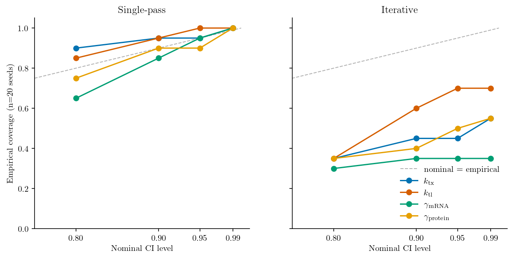

# Calibration of the iterative boundary protocol (issue #11)

**Date:** 2026-05-22
**Branch:** `issue-11-calibration-sweep`
**Data:** `examples/results/step4_calibration_shard_{0,1,2,3}.csv` (20 seeds × 2 protocols × 4 ODE params × 4 nominal levels = 640 rows)

## Scope of this note

`iterative_infer` exists as a proof-of-concept that two separate inference modules (ODE/NUTS and SSA/ABC-SMC) can exchange information across a boundary. It is **not** the protocol the project intends to ship as the production default. The calibration result below is recorded so we know what the current implementation does; the follow-ups at the end are documented for reference, not queued as priorities.

## Verdict

**The iterative (Level-2) boundary protocol is systematically over-confident.** The single-seed observation flagged in PR #10 generalises — it is not bad luck, it is a structural bias of the protocol as currently implemented.

The single-pass (`sequential_infer`) baseline is honestly calibrated; empirical coverage tracks the diagonal and is slightly conservative at low nominal levels (0.80 → ~0.79). Single-pass is the honest default.

## Empirical coverage (n=20 seeds)

| Protocol     | Param            | 80%  | 90%  | 95%  | 99%  |
|--------------|------------------|------|------|------|------|
| Single-pass  | `k_tx`           | 0.90 | 0.95 | 0.95 | 1.00 |
| Single-pass  | `k_tl`           | 0.85 | 0.95 | 1.00 | 1.00 |
| Single-pass  | `gamma_mRNA`     | 0.65 | 0.85 | 0.95 | 1.00 |
| Single-pass  | `gamma_protein`  | 0.75 | 0.90 | 0.90 | 1.00 |
| Iterative    | `k_tx`           | 0.35 | 0.45 | 0.45 | 0.55 |
| Iterative    | `k_tl`           | 0.35 | 0.60 | 0.70 | 0.70 |
| Iterative    | `gamma_mRNA`     | 0.30 | 0.35 | 0.35 | 0.35 |
| Iterative    | `gamma_protein`  | 0.35 | 0.40 | 0.50 | 0.55 |

At a nominal 95% CI, iterative covers truth on only 35–70% of seeds (parameter-dependent). At nominal 99%, iterative tops out at 70% on the best-case parameter. `gamma_mRNA` is the worst: coverage is essentially flat at 0.30–0.35 across all nominal levels — the iterative posterior on `gamma_mRNA` has effectively collapsed away from truth in two-thirds of seeds.

## Supporting diagnostics

- **No seed converged.** All 20 runs hit `max_iters=4`. None reached `kl_tol=0.05`. The KL between successive ODE chains at the final step has median 0.568 across seeds (min 0.149, max 4.29). The loop is not converging; it is drifting — and the drift is what's tightening posteriors past truth.
- **CI widths shrink by ~55–60%** on every shared parameter (e.g. `gamma_mRNA` 0.081 → 0.026; `k_tl` 0.245 → 0.111 at 90% CI). This matches PR #10's tightening claim, but the calibration plot shows the cost: the tightening is not a free win.
- **Iterative costs ~4× the compute** of single-pass (mean 1023 s vs 251 s per seed) and produces a worse-calibrated answer.

## Most likely mechanism

KDE-based message-passing between ODE and SSA blocks. At each iteration, each block fits a KDE to the other block's samples and uses it as a prior. KDEs have finite (KDE-bandwidth-wide) support and finite tail mass. Treating each iteration's KDE as a hard prior repeatedly cuts the tails — a textbook over-propagation of confidence in cut-posterior loops. Without a moment-matching or tempering correction, this drift is one-way and monotone.

## If we ever want to make this protocol production-grade

Recorded for reference, not queued. None of these are priorities given the protocol's current proof-of-concept status.

1. **Moment-matching SSA→ODE handoff.** Replace the KDE prior with a moment-fit Normal (or LogNormal in log-space) sampled from the previous block's posterior. Would test whether KDE tail truncation is the dominant source of the drift.
2. **`convergence::Symbol` kwarg on `iterative_infer`.** Adding `:kl`, `:moment`, `:width` would let a comparison sweep cover several criteria in one job. The width-based criterion in particular is a natural circuit breaker: stop iterating when the per-parameter CI width has stabilised, even if the KL hasn't reached the tolerance.
3. **`max_iters=10, kl_tol=0.005` sweep.** The KL trace never approaches `kl_tol=0.05`, so dropping the tolerance further is unlikely to help on its own.

## Practical takeaway

Use `sequential_infer` for any inference that needs honestly calibrated CIs. Do not advertise `iterative_infer` as a production protocol on the strength of its CI tightening.

## Reproducibility

- 20 seeds: 1001..1020.
- ODE block: `TranscriptionTranslation` + `LightMetabolism`, n_samples=300 NUTS.
- SSA block: `BurstyGeneExpression`, n_particles=200, n_populations=6, n_replicates=50.
- Iterative: `max_iters=4`, `kl_tol=0.05`, KDE handoff.
- Truth: `k_tx=1.0, k_tl=2.0, gamma_mRNA=0.5, gamma_protein=0.1`.
- Slurm: 4 × 5-seed array jobs (`--array=0-3`, `--time=04:00:00`).
- Driver: `examples/calibration_sweep.jl`; plot: `examples/step4_calibration_curve.py`.
